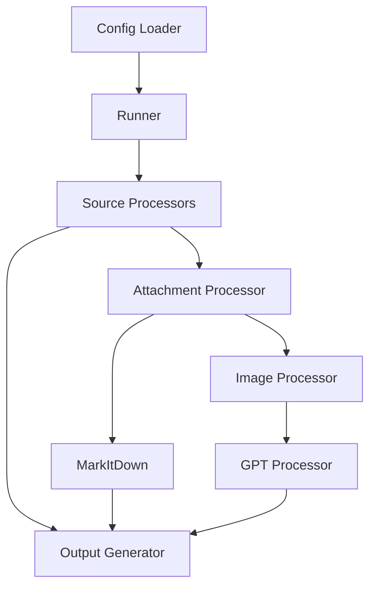

# Architecture Overview

## Core Components

### Configuration System
- **Config**: Central configuration handler using TOML format
- **GlobalConfig**: Global settings like working directory and API keys
- **SourceConfig**: Source-specific settings for Bear notes and X bookmarks

### Processing Pipeline
1. **Source Processors**
   - `BearProcessor`: Handles Bear notes and their attachments
   - `XBookmarksProcessor`: Processes X bookmarks and media
   - Base `SourceProcessor` class defines common interface

2. **Attachment Processing**
   - `AttachmentProcessor`: Routes files to appropriate handlers
   - `MarkItDown`: Converts documents to markdown format
   - `ImageProcessor`: Handles image conversion and optimization
   - `GPTProcessor`: Generates image descriptions using OpenAI

3. **Output Generation**
   - `OutputGenerator`: Creates consistent markdown output
   - Atomic file operations with backup support
   - Standardized formatting for documents and images

## Data Flow


## Key Features

### Parallel Processing
- Multi-threaded source processing
- Configurable with --sequential option
- Automatic CPU core detection

### Error Handling
- Graceful failure recovery
- Detailed error logging
- Source-level isolation

### Resource Management
- Temporary file cleanup
- Memory usage optimization
- Atomic file operations

### Security
- No execution of untrusted content
- API key management
- Safe path handling

## Directory Structure
```
consolidate_markdown/
├── .cm/                    # Working directory
│   ├── logs/              # Log files
│   ├── markitdown/        # Document conversion
│   └── images/            # Image processing
├── src/
│   └── consolidate_markdown/
│       ├── processors/    # Source processors
│       ├── attachments/   # File handlers
│       └── config.py      # Configuration
└── tests/
    ├── unit/             # Unit tests
    └── integration/      # Integration tests
```

## Extension Points

### Adding New Source Types
1. Create new processor class inheriting from `SourceProcessor`
2. Implement `process()` and `validate()` methods
3. Add to `PROCESSORS` registry in Runner

### Adding File Type Support
1. Update `AttachmentProcessor` routing
2. Implement conversion in `MarkItDown`
3. Add metadata extraction
4. Update tests and documentation

## Performance Considerations

### Memory Management
- Streaming file processing
- Cleanup of temporary files
- Resource monitoring

### Processing Optimization
- Parallel source processing
- Caching of converted files
- Skip unchanged files

### Scalability
- Independent source processing
- Configurable thread count
- Resource usage limits
