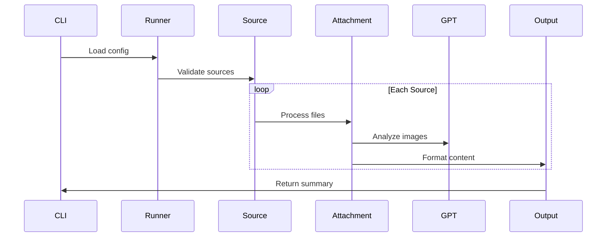
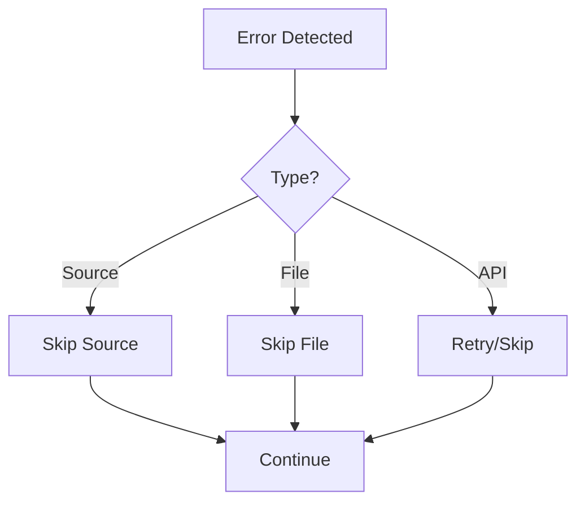

# Data Flow Documentation

## Processing Pipeline



## Component Interactions

### 1. Configuration Loading
```python
Config -> Runner:
    - Global settings
    - Source configurations
    - Processing options
```

### 2. Source Processing
```python
Runner -> SourceProcessor:
    - Source validation
    - File discovery
    - Attachment correlation
```

### 3. Attachment Handling
```python
SourceProcessor -> AttachmentProcessor:
    - File type detection
    - Format conversion
    - Metadata extraction
```

### 4. Content Generation
```python
AttachmentProcessor -> OutputGenerator:
    - Markdown formatting
    - File organization
    - Backup management
```

## File Handling

### Input Processing
1. Source discovery
2. File validation
3. Type detection
4. Conversion planning

### Content Processing
1. Document conversion
2. Image processing
3. GPT analysis
4. Metadata extraction

### Output Generation
1. Content formatting
2. File organization
3. Atomic writing
4. Backup creation

## Error Handling

### Recovery Flow


### Error Propagation
1. File-level errors
2. Source-level errors
3. System-level errors
4. API errors

## Resource Management

### Memory Flow
1. File streaming
2. Temporary storage
3. Cleanup processes
4. Resource monitoring

### Disk Operations
1. Temporary files
2. Atomic writes
3. Backup creation
4. Cleanup routines
